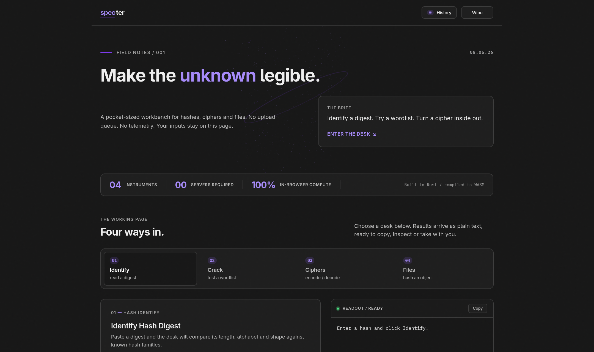

# Specter

Fast, offline-first cryptanalysis and cybersecurity toolkit built with Rust and WebAssembly.

Specter delivers in-browser cryptographic hash identification, multi-algorithm checksum generation, dictionary and bounded brute-force hash cracking, classical cipher codecs with statistical heuristic detection, and client-side file forensics. All computations run 100% on the client machine via WebAssembly with zero external network requests.

---

## Live Workbench

The production build is deployed directly on GitHub Pages:

**https://sh4dowbl4d3.github.io/specter/**

---

## Preview



---

## Key Capabilities

- **Zero-Network Architecture**: Every algorithm, cracking loop, and cipher transform runs locally inside the browser. No data ever leaves your device.
- **Memory Safety and Speed**: Core algorithms are implemented in pure Rust and compiled to WebAssembly for native execution speed.
- **Non-Blocking Execution**: Long-running brute-force cracking and streaming file hashing yield cooperatively to the browser event loop to preserve UI responsiveness.
- **Ephemeral Session Security**: In-memory ring buffer for session history with instant one-click privacy purge and export capabilities.

---

## Toolkit Instruments

Specter is divided into four focused operational desks:

### 1. Hash Identification and Generation Desk

- **Heuristic Hash Identification**: Analyzes digest length, character set, and format signatures against known cryptographic hash families (MD5, SHA-1, SHA-224, SHA-256, SHA-384, SHA-512, SHA-3 variants, bcrypt, NTLM, MySQL 3.23, MySQL 4.1+, RIPEMD-160). Outputs confidence scoring, format notes, and Hashcat/John attack mode numbers.
- **Simultaneous Multi-Hash Generation**: Computes 9 digest algorithms in a single streaming pass (MD5, SHA-1, SHA-224, SHA-256, SHA-384, SHA-512, NTLM, MySQL 3.23, MySQL 4.1+).
- **Hash Signature Comparison**: Compares two digests with case-insensitive normalization, length checking, and algorithm signature validation.

### 2. Hash Cracking Desk

- **Dictionary Attack**: High-throughput candidate matching against custom wordlists pasted directly or loaded from local `.txt` or `.lst` files.
- **Batched Asynchronous Brute-Force**: Exhaustive keyspace search over configurable character sets (lowercase, alphanumeric, digits) with a 20,000,000 computation budget limit, real-time keyspace estimation, and cancel/resume controls.

### 3. Classical Ciphers and Encodings Desk

- **Encoding Formats**: Base64 (RFC 4648), Hexadecimal (with delimiter formatting), Binary (8-bit bytes), ASCII Decimal (space, comma, semicolon, newline delimiters), URL / Percent Encoding.
- **Classical Ciphers**: Caesar (with full 25-shift cryptanalysis preview), ROT13, Atbash, Vigenère (key-based), Affine, Baconian, Morse Code, Rail Fence transposition, and XOR key streaming.
- **Chained Transformation Pipelines**: Multi-step pipeline execution for layered encoding and decoding workflows.
- **Statistical Auto-Detection Engine**: Analyzes Shannon entropy, character set distributions, English quadgram frequencies, decodability heuristics, and dictionary rankings to identify and score unknown ciphertext payloads.

### 4. File Forensics and Object Transform Desk

- **Client-Side File Checksumming**: Streams and hashes files up to 64 MiB in 64 KiB memory chunks without loading the full file into DOM memory.
- **Text File Cipher Transforms**: Direct file-to-file transformation for Base64, Hex, ROT13, and Atbash with immediate browser download.

### 5. Ephemeral Session Audit Drawer

- **In-Memory Ring Buffer**: Stores recent operations in RAM with a 100-entry capacity limit.
- **Privacy Wipe**: One-click purge clears all form inputs, memory buffers, and session history records.
- **Structured Audit Export**: Exports session history as formatted Markdown (`specter-session-audit.md`) or machine-readable JSON (`specter-session-audit.json`).

---

## Supported Algorithms and Codecs

| Category | Algorithms / Formats | Execution Target |
|---|---|---|
| **Cryptographic Hashes** | MD5, SHA-1, SHA-224, SHA-256, SHA-384, SHA-512 | Rust / WebAssembly |
| **Legacy / System Hashes** | NTLM (MD4 UTF-16LE), MySQL 3.23, MySQL 4.1+ | Rust / WebAssembly |
| **Hash Identification** | MD5, SHA-1, SHA-2, SHA-3, bcrypt, NTLM, MySQL, RIPEMD | Heuristic Engine |
| **Standard Encodings** | Base64, Hexadecimal, Binary, ASCII Decimal, URL Percent | Rust / WebAssembly |
| **Classical Ciphers** | Caesar, ROT13, Atbash, Vigenère, Affine, Baconian, Morse, Rail Fence, XOR | Rust / WebAssembly |

---

## Privacy and Threat Model

Specter is engineered around strict privacy principles:

1. **Zero Server Transmission**: No inputs, hashes, candidate wordlists, or files are sent to any remote server.
2. **Zero Persistent Storage**: No tracking cookies, no `localStorage`, and no `indexedDB`. Refreshing or closing the tab completely clears all runtime state.
3. **Strict Content Security Policy**: Uses `default-src 'self'` with explicit directives restricting external connections, disallowing object embeds, and isolating execution.
4. **Offline Capability**: Progressive Web App (PWA) manifest support allows caching and running completely offline.

---

## Global Keyboard Shortcuts

| Shortcut | Action | Scope |
|---|---|---|
| `Alt` + `1` | Switch to Identify Desk | Global |
| `Alt` + `2` | Switch to Crack Desk | Global |
| `Alt` + `3` | Switch to Ciphers Desk | Global |
| `Alt` + `4` | Switch to Files Desk | Global |
| `Alt` + `H` / `Ctrl` + `H` | Toggle Session History Drawer | Global |
| `Ctrl` + `Enter` / `Cmd` + `Enter` | Execute primary action for active desk | Global / Input focus |
| `Escape` | Close session drawer / dismiss notifications | Global |

---

## Project Structure

The project decouples core cryptographic logic from the browser frontend:

```
specter/
├── Cargo.toml                       # Workspace definition and release profiles
├── Cargo.lock
├── README.md                        # Documentation
├── STRUCTURE.md                     # Architectural layout
├── LICENSE                          # MIT License
├── screenshots/
│   └── screenshot.png               # Workbench interface preview
│
├── crates/
│   ├── core/                        # specter-core: Pure Rust algorithm library
│   │   ├── Cargo.toml               # md5, sha1, sha2, md4, base64, hex, serde
│   │   ├── src/
│   │   │   ├── lib.rs               # Module exports
│   │   │   ├── hash_id/             # Heuristic hash identification
│   │   │   ├── hasher/              # Cryptographic and streaming hashers
│   │   │   ├── cracker/             # Dictionary and brute-force engines
│   │   │   ├── cipher_tools/        # Ciphers, encoders, and auto-detect
│   │   │   └── history/             # Session audit buffer and exporters
│   │   └── tests/
│   │       ├── integration.rs       # Cross-module integration tests
│   │       └── e2e_real_vectors.rs  # NIST and RFC real-vector test suite
│   │
│   └── wasm-frontend/               # wasm-frontend: WebAssembly browser client
│       ├── Cargo.toml               # wasm-bindgen, web-sys, js-sys
│       ├── Trunk.toml               # Trunk build configuration
│       ├── index.html               # Semantic HTML application shell
│       ├── 404.html                 # Single-page application redirector
│       ├── manifest.json            # PWA manifest
│       ├── style.css                # Obsidian design system stylesheet
│       ├── motion.js                # Canvas background animation
│       └── src/
│           └── lib.rs               # DOM event listeners and WASM entry point
│
└── .github/
    └── workflows/
        └── deploy.yml               # CI/CD: Quality gates, security audit, Pages deploy
```

---

## Local Development and Building

### Prerequisites

- Rust (2021 edition, version 1.80 or newer):
  ```bash
  curl --proto '=https' --tlsv1.2 -sSf https://sh.rustup.rs | sh
  ```
- WebAssembly target:
  ```bash
  rustup target add wasm32-unknown-unknown
  ```
- Trunk:
  ```bash
  cargo install trunk --version 0.21.14 --locked
  ```
- wasm-bindgen-cli:
  ```bash
  cargo install wasm-bindgen-cli --version 0.2.126 --locked
  ```

### Development Server

Run the development server with hot-reloading:

```bash
cd crates/wasm-frontend
trunk serve --port 8080
```

Open `http://localhost:8080` in your browser.

### Production Build

Compile optimized WebAssembly release artifacts:

```bash
cd crates/wasm-frontend
trunk build --release --public-url "./"
```

Compiled distribution artifacts will be output to `crates/wasm-frontend/dist/`.

---

## Quality Assurance and Testing

Specter enforces strict quality gates across formatting, linting, and automated testing:

```bash
# Run all 139 tests across the workspace
cargo test --workspace --all-targets

# Check code formatting
cargo fmt --all -- --check

# Run Clippy with warnings treated as errors
cargo clippy --workspace --all-targets -- -D warnings

# Validate WebAssembly compilation
cargo check -p wasm-frontend --target wasm32-unknown-unknown

# Generate API documentation
cargo doc --workspace --no-deps
```

### Automated Test Coverage

- **83 Unit Tests**: Algorithmic correctness across hashing, cracking, classical ciphers, and history tracking.
- **42 Integration Tests**: Cross-module pipeline verification, streaming equivalence, and purity tests.
- **14 Real-Vector Verification Tests**: Verified against official RFC 1321 (MD5), RFC 3174 (SHA-1), FIPS 180-4 (SHA-2), Windows SAM (NTLM), and CyberChef test vectors.

---

## License

This project is licensed under the [MIT License](LICENSE).
